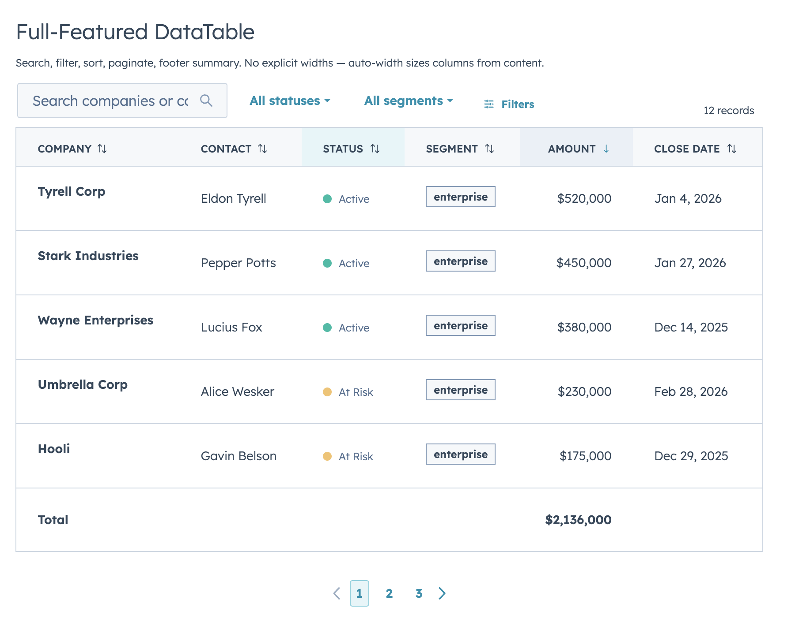
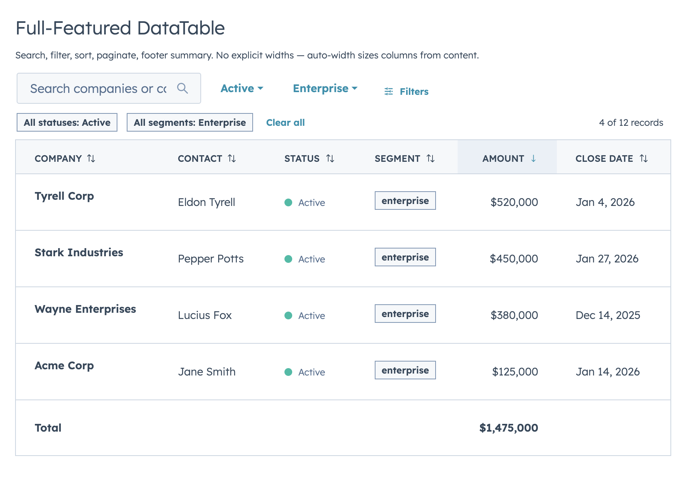
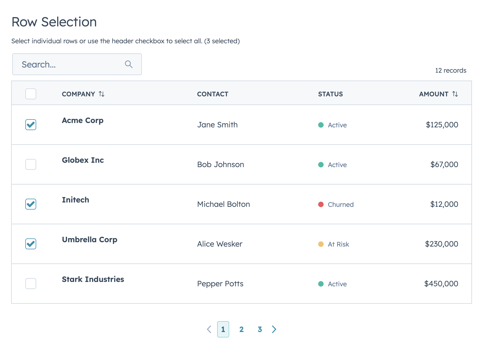
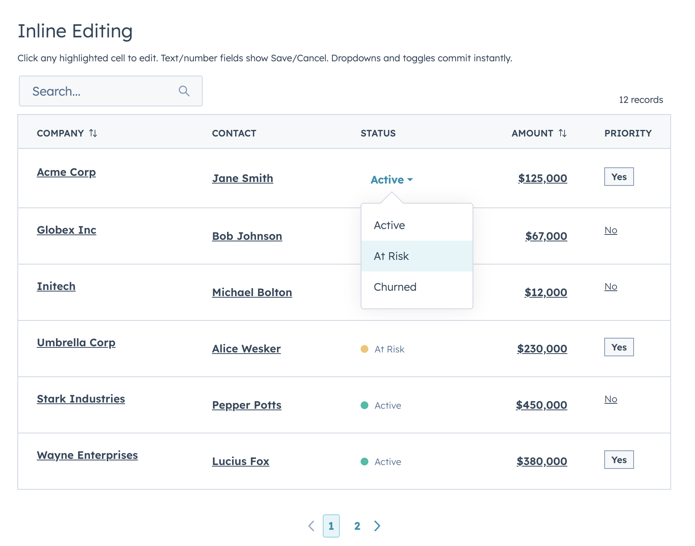
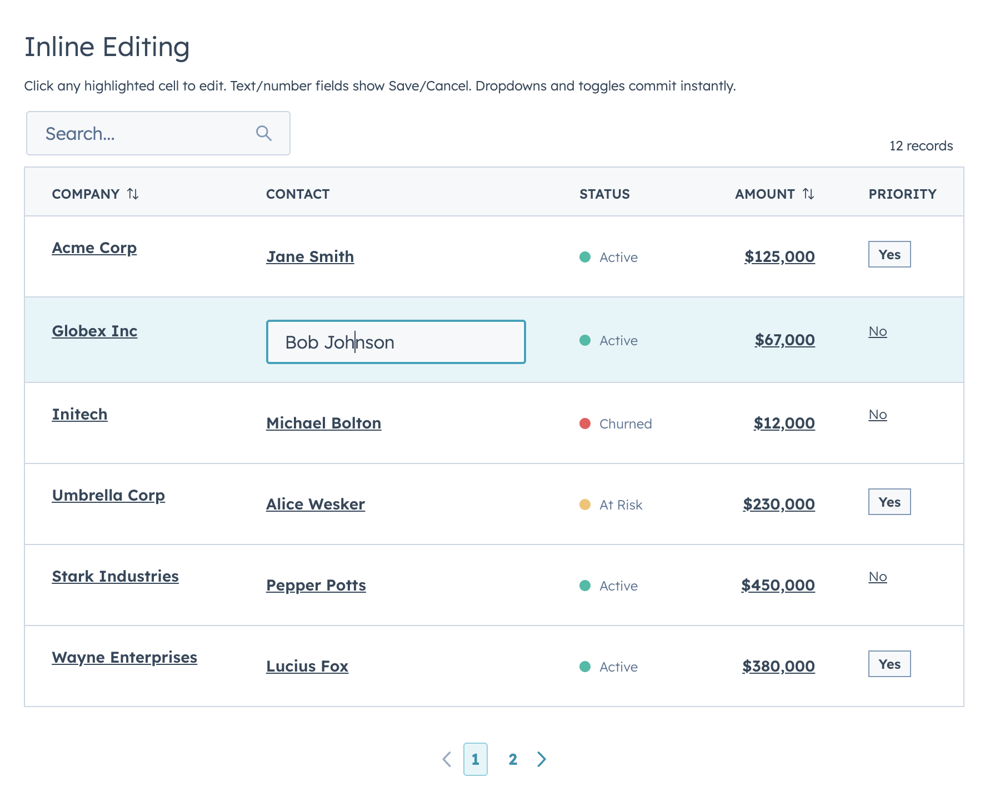
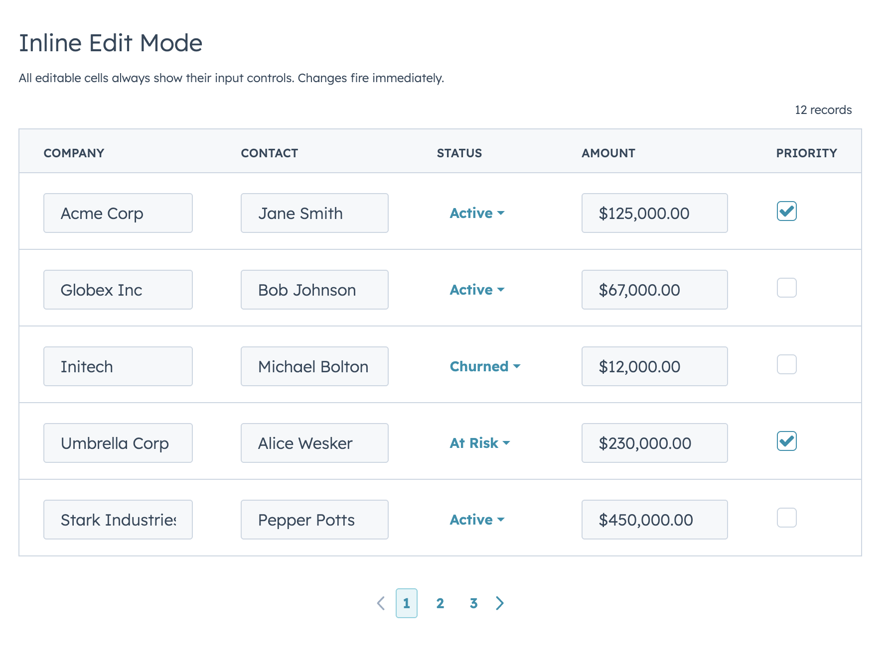
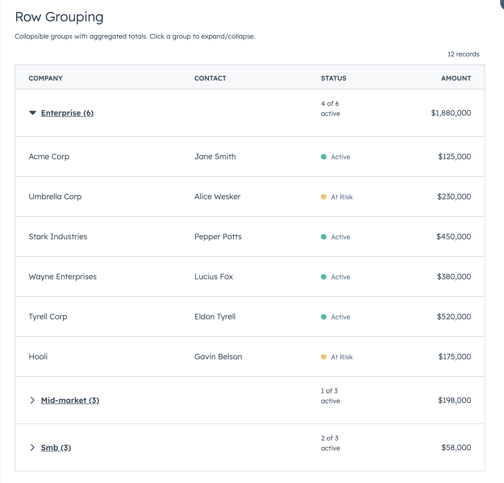

# HubSpot DataTable

A feature-rich, reusable table component for HubSpot UI Extensions. Drop it into any CRM card and get search, filtering, sorting, pagination, collapsible row grouping, row selection, inline editing, and intelligent auto-width — all built with native `@hubspot/ui-extensions` components.



## Features

- **Search** — Full-text search across any fields
- **Filters** — Select, multi-select, and date range filters with active filter chips
- **Sorting** — Click-to-sort with three-state cycle (none → ascending → descending → none)
- **Pagination** — Client-side or server-side with configurable page size
- **Row Grouping** — Collapsible groups with aggregation functions per column
- **Row Selection** — Checkbox column with select-all
- **Inline Editing** — Two edit modes (discrete click-to-edit and always-visible inline) with 10 input types and input validation
- **Auto-Width** — Intelligent column sizing based on content analysis (data types, string lengths, edit types)
- **Footer Rows** — Summary/total rows computed from filtered data
- **Server-Side Mode** — Callbacks for search, filter, sort, and page changes
- **Empty State** — Built-in empty state when no results match

## Installation

Copy `DataTable.jsx` into your HubSpot project's components directory:

```
src/app/cards/components/DataTable.jsx
```

Import it in your card:

```jsx
import { DataTable } from "./components/DataTable.jsx";
```

No additional dependencies — only uses `@hubspot/ui-extensions`.

---

## Examples

### Basic table with search and sorting

The simplest DataTable — define your columns with `renderCell`, pass your data, and specify which fields are searchable. Auto-width handles column sizing automatically.

```jsx
import React from "react";
import { Flex, Text, hubspot } from "@hubspot/ui-extensions";
import { DataTable } from "./components/DataTable.jsx";

const CONTACTS = [
  { id: 1, name: "Jane Smith", email: "jane@acme.com", role: "VP Sales" },
  { id: 2, name: "Bob Johnson", email: "bob@globex.com", role: "Engineer" },
  { id: 3, name: "Alice Wesker", email: "alice@umbrella.com", role: "CEO" },
];

const COLUMNS = [
  {
    field: "name",
    label: "Name",
    sortable: true,
    renderCell: (val) => <Text format={{ fontWeight: "demibold" }}>{val}</Text>,
  },
  { field: "email", label: "Email", sortable: true, renderCell: (val) => val },
  { field: "role", label: "Role", renderCell: (val) => val },
];

hubspot.extend(() => (
  <DataTable
    data={CONTACTS}
    columns={COLUMNS}
    searchFields={["name", "email"]}
    searchPlaceholder="Search contacts..."
    pageSize={10}
    defaultSort={{ name: "ascending" }}
  />
));
```

> **Tip:** You can also use `renderRow` for full row control instead of `renderCell`, but `renderCell` is required when using `selectable`, editable columns, or `groupBy`.

---

### Filters, sorting, and footer totals



When more than 2 filters are defined, the first 2 appear inline and the rest are tucked behind a **Filters** button with a funnel icon. Active filters display as removable chips with a "Clear all" option. The footer receives the filtered data so totals stay accurate.

```jsx
import React from "react";
import { Text, StatusTag, Tag, TableRow, TableHeader, hubspot } from "@hubspot/ui-extensions";
import { DataTable } from "./components/DataTable.jsx";

const DEALS = [
  { id: 1, company: "Acme Corp", status: "active", segment: "enterprise", amount: 125000, closeDate: "2026-01-15" },
  { id: 2, company: "Globex Inc", status: "active", segment: "mid-market", amount: 67000, closeDate: "2026-02-03" },
  { id: 3, company: "Initech", status: "churned", segment: "smb", amount: 12000, closeDate: "2025-11-20" },
  { id: 4, company: "Umbrella Corp", status: "at-risk", segment: "enterprise", amount: 230000, closeDate: "2026-03-01" },
];

const STATUS_COLORS = { active: "success", "at-risk": "warning", churned: "danger" };

const formatCurrency = (val) =>
  new Intl.NumberFormat("en-US", { style: "currency", currency: "USD", maximumFractionDigits: 0 }).format(val);

const COLUMNS = [
  { field: "company", label: "Company", sortable: true,
    renderCell: (val) => <Text format={{ fontWeight: "demibold" }}>{val}</Text> },
  { field: "status", label: "Status", sortable: true,
    renderCell: (val) => <StatusTag variant={STATUS_COLORS[val]}>{val}</StatusTag> },
  { field: "segment", label: "Segment", sortable: true,
    renderCell: (val) => <Tag variant="default">{val}</Tag> },
  { field: "amount", label: "Amount", sortable: true, align: "right",
    renderCell: (val) => formatCurrency(val) },
  { field: "closeDate", label: "Close Date", sortable: true,
    renderCell: (val) => new Date(val).toLocaleDateString("en-US", { month: "short", day: "numeric", year: "numeric" }) },
];

const FILTERS = [
  {
    name: "status",
    type: "select",
    placeholder: "All statuses",
    options: [
      { label: "Active", value: "active" },
      { label: "At Risk", value: "at-risk" },
      { label: "Churned", value: "churned" },
    ],
  },
  {
    name: "segment",
    type: "select",
    placeholder: "All segments",
    options: [
      { label: "Enterprise", value: "enterprise" },
      { label: "Mid-Market", value: "mid-market" },
      { label: "SMB", value: "smb" },
    ],
  },
  {
    name: "closeDate",
    type: "dateRange",
    placeholder: "Close date",
  },
];

hubspot.extend(() => (
  <DataTable
    data={DEALS}
    columns={COLUMNS}
    searchFields={["company"]}
    searchPlaceholder="Search companies..."
    filters={FILTERS}
    pageSize={5}
    defaultSort={{ amount: "descending" }}
    footer={(filteredData) => (
      <TableRow>
        <TableHeader>Total</TableHeader>
        <TableHeader />
        <TableHeader />
        <TableHeader align="right">
          {formatCurrency(filteredData.reduce((sum, r) => sum + r.amount, 0))}
        </TableHeader>
        <TableHeader />
      </TableRow>
    )}
  />
));
```

#### Custom filter functions

Override the default filter logic for any filter. This is useful for range-based filters or computed values:

```jsx
const FILTERS = [
  {
    name: "amount",
    type: "select",
    placeholder: "Deal size",
    options: [
      { label: "Under $50K", value: "small" },
      { label: "$50K - $200K", value: "medium" },
      { label: "Over $200K", value: "large" },
    ],
    filterFn: (row, value) => {
      if (value === "small") return row.amount < 50000;
      if (value === "medium") return row.amount >= 50000 && row.amount <= 200000;
      return row.amount > 200000;
    },
  },
];
```

---

### Row selection



Add checkboxes with a select-all header. Selection state resets when search or filters change. Requires `renderCell` on each column.

```jsx
import React, { useState } from "react";
import { Flex, Heading, Text, StatusTag, hubspot } from "@hubspot/ui-extensions";
import { DataTable } from "./components/DataTable.jsx";

hubspot.extend(() => <SelectableTable />);

function SelectableTable() {
  const [selected, setSelected] = useState([]);

  const columns = [
    { field: "name", label: "Company", sortable: true,
      renderCell: (val) => <Text format={{ fontWeight: "demibold" }}>{val}</Text> },
    { field: "contact", label: "Contact", renderCell: (val) => val },
    { field: "status", label: "Status",
      renderCell: (val) => <StatusTag variant={val === "active" ? "success" : "warning"}>{val}</StatusTag> },
  ];

  return (
    <Flex direction="column" gap="sm">
      <Heading>Companies</Heading>
      {selected.length > 0 && (
        <Text variant="microcopy">{selected.length} selected</Text>
      )}
      <DataTable
        data={COMPANIES}
        columns={columns}
        selectable={true}
        rowIdField="id"
        onSelectionChange={setSelected}
        searchFields={["name", "contact"]}
        pageSize={10}
      />
    </Flex>
  );
}
```

---

### Inline editing — discrete mode




In discrete mode (the default), editable cells appear as dark links. Click to open the input. The cell reverts to display when you click away, keeping the last entered value. Select, checkbox, and toggle inputs commit and close instantly on change.

```jsx
import React, { useState, useCallback } from "react";
import { Text, StatusTag, Tag, hubspot } from "@hubspot/ui-extensions";
import { DataTable } from "./components/DataTable.jsx";

const STATUS_COLORS = { active: "success", "at-risk": "warning", churned: "danger" };
const STATUS_LABELS = { active: "Active", "at-risk": "At Risk", churned: "Churned" };

hubspot.extend(() => <EditableTable />);

function EditableTable() {
  const [data, setData] = useState(DEALS);

  const handleEdit = useCallback((row, field, newValue) => {
    setData((prev) =>
      prev.map((r) => (r.id === row.id ? { ...r, [field]: newValue } : r))
    );
  }, []);

  const columns = [
    {
      field: "company", label: "Company", sortable: true,
      editable: true, editType: "text",
      renderCell: (val) => <Text format={{ fontWeight: "demibold" }}>{val}</Text>,
    },
    {
      field: "status", label: "Status",
      editable: true, editType: "select",
      editOptions: [
        { label: "Active", value: "active" },
        { label: "At Risk", value: "at-risk" },
        { label: "Churned", value: "churned" },
      ],
      renderCell: (val) => <StatusTag variant={STATUS_COLORS[val]}>{STATUS_LABELS[val]}</StatusTag>,
    },
    {
      field: "amount", label: "Amount", align: "right",
      editable: true, editType: "currency",
      renderCell: (val) => formatCurrency(val),
    },
    {
      field: "priority", label: "Priority",
      editable: true, editType: "checkbox",
      renderCell: (val) => val ? <Tag variant="default">Yes</Tag> : <Text variant="microcopy">No</Text>,
    },
  ];

  return (
    <DataTable
      data={data}
      columns={columns}
      rowIdField="id"
      onRowEdit={handleEdit}
      searchFields={["company"]}
      pageSize={10}
    />
  );
}
```

> **Note:** `align` is automatically stripped from cells and headers when input controls are visible, since HubSpot input components don't respect the parent cell's text alignment. You can still set `align` on editable columns — it applies correctly in the display view.

---

### Inline editing — inline mode



In inline mode, all editable cells always show their input controls. Changes fire `onRowEdit` immediately. Set `editMode="inline"` to enable.

```jsx
<DataTable
  data={data}
  columns={columns}
  rowIdField="id"
  editMode="inline"
  onRowEdit={handleEdit}
  pageSize={5}
/>
```

**Supported `editType` values:**

| editType | Component | Commit Behavior |
|---|---|---|
| `text` | Input | Fires on every change, exits on blur |
| `textarea` | TextArea | Fires on every change, exits on blur |
| `number` | NumberInput | Fires on every change, exits on blur |
| `currency` | CurrencyInput | Fires on every change, exits on blur |
| `stepper` | StepperInput | Fires on every change, exits on blur |
| `select` | Select | Instant on change |
| `multiselect` | MultiSelect | Instant on change |
| `date` | DateInput | Instant on change |
| `toggle` | Toggle | Instant on change |
| `checkbox` | Checkbox | Instant on change |

Use `editProps` to pass additional props to the edit component (e.g., `{ currencyCode: "EUR" }` for CurrencyInput).

---

### Row grouping with aggregations



Collapsible groups with per-column aggregation functions. Click a group header to expand or collapse it. Groups start expanded by default.

```jsx
import React from "react";
import { Text, StatusTag, hubspot } from "@hubspot/ui-extensions";
import { DataTable } from "./components/DataTable.jsx";

const STATUS_COLORS = { active: "success", "at-risk": "warning", churned: "danger" };

const formatCurrency = (val) =>
  new Intl.NumberFormat("en-US", { style: "currency", currency: "USD", maximumFractionDigits: 0 }).format(val);

const COLUMNS = [
  { field: "company", label: "Company", renderCell: (val) => val },
  { field: "contact", label: "Contact", renderCell: (val) => val },
  { field: "status", label: "Status",
    renderCell: (val) => <StatusTag variant={STATUS_COLORS[val]}>{val}</StatusTag> },
  { field: "amount", label: "Amount", align: "right",
    renderCell: (val) => formatCurrency(val) },
];

hubspot.extend(() => (
  <DataTable
    data={DEALS}
    columns={COLUMNS}
    groupBy={{
      field: "segment",
      label: (value, rows) => `${value.charAt(0).toUpperCase() + value.slice(1)} (${rows.length})`,
      sort: "asc",
      defaultExpanded: true,
      aggregations: {
        amount: (rows) => formatCurrency(rows.reduce((sum, r) => sum + r.amount, 0)),
        status: (rows) => {
          const active = rows.filter((r) => r.status === "active").length;
          return <Text variant="microcopy">{active} of {rows.length} active</Text>;
        },
      },
    }}
    pageSize={30}
  />
));
```

You can also provide static values per group instead of aggregation functions:

```jsx
groupBy={{
  field: "region",
  label: (value) => value,
  groupValues: {
    "North America": { revenue: "$2.1M" },
    "Europe": { revenue: "$1.4M" },
  },
}}
```

---

### Auto-width

By default, columns without explicit `width` or `cellWidth` get auto-computed widths based on content analysis. Disable with `autoWidth={false}`.

**Heuristics:**

| Data Pattern | Header Width | Cell Width |
|---|---|---|
| Booleans (`true`/`false`) | `min` | `min` |
| Dates (ISO format) | `min` | `auto` |
| Numbers | `auto` | `auto` |
| Small enums (≤5 unique, ≤15 chars) | `min` | `auto` |
| Text | `auto` | `auto` |

**Smart behaviors:**
- Editable columns (except checkbox/toggle) are never constrained to `min` headers — input components need room
- `align` is automatically stripped from headers and cells when showing input controls
- In discrete edit mode, the active cell switches to `auto` width to accommodate the input

**Manual overrides** always take priority. You can set `width` (applies to header and cells) and `cellWidth` (cells only):

```jsx
// Header and cells both use "max"
{ field: "name", label: "Name", width: "max" }

// Header tight around label, cells expand to show full values
{ field: "name", label: "Name", width: "min", cellWidth: "max" }

// Disable auto-width for a specific column
{ field: "notes", label: "Notes", width: "auto", cellWidth: "auto" }
```

---

### Server-side mode

Let the parent manage data fetching. The component renders UI controls and calls back on every interaction. Filtering, sorting, and pagination are all delegated to the parent.

```jsx
import React, { useState, useEffect } from "react";
import { hubspot } from "@hubspot/ui-extensions";
import { DataTable } from "./components/DataTable.jsx";

hubspot.extend(({ runServerlessFunction }) => (
  <ServerSideTable runServerlessFunction={runServerlessFunction} />
));

function ServerSideTable({ runServerlessFunction }) {
  const [data, setData] = useState([]);
  const [totalCount, setTotalCount] = useState(0);
  const [page, setPage] = useState(1);

  const fetchData = async (params = {}) => {
    const result = await runServerlessFunction({
      name: "fetchRecords",
      parameters: { page: 1, pageSize: 25, ...params },
    });
    setData(result.records);
    setTotalCount(result.total);
  };

  useEffect(() => { fetchData(); }, []);

  return (
    <DataTable
      serverSide={true}
      data={data}
      totalCount={totalCount}
      columns={COLUMNS}
      searchFields={["name"]}
      filters={FILTERS}
      pageSize={25}
      page={page}
      onSearchChange={(term) => fetchData({ search: term, page: 1 })}
      onFilterChange={(filters) => fetchData({ filters, page: 1 })}
      onSortChange={(field, direction) => fetchData({ sort: field, dir: direction })}
      onPageChange={(p) => { setPage(p); fetchData({ page: p }); }}
    />
  );
}
```

---

## API Reference

### DataTable Props

| Prop | Type | Default | Description |
|---|---|---|---|
| `data` | Array | *required* | Array of row objects |
| `columns` | Array | *required* | Column definitions (see below) |
| `renderRow` | `(row) => ReactNode` | — | Renders a full `<TableRow>`. Omit to use column-based rendering via `renderCell`. |
| `searchFields` | string[] | `[]` | Fields to search across |
| `searchPlaceholder` | string | `"Search..."` | Placeholder text for search input |
| `filters` | Array | `[]` | Filter configurations (see below) |
| `pageSize` | number | `10` | Rows per page |
| `defaultSort` | object | `{}` | Initial sort state, e.g. `{ name: "ascending" }` |
| `groupBy` | object | — | Grouping config (see below) |
| `footer` | `(filteredData) => ReactNode` | — | Footer row renderer |
| `emptyTitle` | string | `"No results found"` | Empty state heading |
| `emptyMessage` | string | `"No records match..."` | Empty state body |
| `selectable` | boolean | `false` | Enable row selection checkboxes |
| `rowIdField` | string | `"id"` | Field name for unique row identifier |
| `onSelectionChange` | `(ids[]) => void` | — | Called when selection changes |
| `editMode` | `"discrete"` \| `"inline"` | `"discrete"` | Edit mode: click-to-edit or always-visible inputs |
| `onRowEdit` | `(row, field, newValue) => void` | — | Called when a cell edit is committed |
| `autoWidth` | boolean | `true` | Auto-compute column widths from content analysis |
| `serverSide` | boolean | `false` | Enable server-side mode |
| `totalCount` | number | — | Total record count (server-side) |
| `page` | number | — | Current page (server-side, controlled) |
| `onSearchChange` | `(term) => void` | — | Search callback (server-side) |
| `onFilterChange` | `(filterValues) => void` | — | Filter callback (server-side) |
| `onSortChange` | `(field, direction) => void` | — | Sort callback (server-side) |
| `onPageChange` | `(page) => void` | — | Page callback (server-side) |

### Column Definition

| Property | Type | Description |
|---|---|---|
| `field` | string | Key in the row object |
| `label` | string | Column header text |
| `sortable` | boolean | Enable sorting on this column |
| `width` | `"min"` \| `"max"` \| `"auto"` | Column width (header + cell fallback) |
| `cellWidth` | `"min"` \| `"max"` \| `"auto"` | Cell-only width override |
| `align` | `"left"` \| `"center"` \| `"right"` | Text alignment (auto-stripped when inputs are visible) |
| `renderCell` | `(value, row) => ReactNode` | Custom cell content renderer |
| `editable` | boolean | Enable inline editing for this column |
| `editType` | string | Input type (see supported types above) |
| `editOptions` | Array | Options for select/multiselect edit types |
| `editValidate` | `(value, row) => true \| string` | Validation function. Return `true` if valid, or an error message string. Invalid values block the edit from committing. |
| `editProps` | object | Additional props passed to the edit input component |

### GroupBy Definition

| Property | Type | Description |
|---|---|---|
| `field` | string | Field to group rows by |
| `label` | `(value, rows) => string` | Custom group header label |
| `sort` | `"asc"` \| `"desc"` \| `(a, b) => number` | Group sort order |
| `defaultExpanded` | boolean | Whether groups start expanded (default `true`) |
| `aggregations` | `{ [field]: (rows, groupKey) => ReactNode }` | Per-column aggregation functions for group headers |
| `groupValues` | `{ [groupKey]: { [field]: ReactNode } }` | Static values per group per column |

### Filter Definition

| Property | Type | Description |
|---|---|---|
| `name` | string | Field name to filter on |
| `type` | `"select"` \| `"multiselect"` \| `"dateRange"` | Filter type |
| `placeholder` | string | Placeholder/label text |
| `options` | `{ label, value }[]` | Options for select/multiselect |
| `chipLabel` | string | Label prefix for filter chips |
| `filterFn` | `(row, value) => boolean` | Custom filter function |

### Input Validation

Add `editValidate` to any editable column. The function receives the current value and the full row, and should return `true` if valid or an error message string. Invalid values show inline errors and are blocked from committing.

```jsx
const columns = [
  {
    field: "name",
    label: "Company",
    editable: true,
    editType: "text",
    editValidate: (value, row) => {
      if (!value || value.trim() === "") return "Company name is required";
      if (value.length < 2) return "Must be at least 2 characters";
      return true;
    },
    renderCell: (val) => <Text format={{ fontWeight: "demibold" }}>{val}</Text>,
  },
  {
    field: "amount",
    label: "Amount",
    editable: true,
    editType: "currency",
    editValidate: (value, row) => {
      if (value === null || value === undefined) return "Amount is required";
      if (Number(value) < 0) return "Amount cannot be negative";
      if (Number(value) > 1000000) return "Cannot exceed $1,000,000";
      return true;
    },
    renderCell: (val) => formatCurrency(val),
  },
];
```

Validation works in both edit modes:
- **Discrete mode** — errors display inline as the user types (via `onInput`). The edit is blocked from committing until the value passes validation. While a validation error is active, the input cannot be dismissed via blur — the user must fix the value before they can leave the cell.
- **Inline mode** — each cell tracks its own validation state independently. Invalid values are blocked from firing `onRowEdit`.

---

## Limitations

Before choosing DataTable, be aware of these HubSpot UI Extensions constraints:

| Limitation | Details |
|---|---|
| **No sticky headers** | HubSpot's `Table` component doesn't support sticky/fixed headers. Long tables scroll the headers out of view. Use `pageSize` to keep tables short. |
| **No column resizing** | Users cannot drag to resize columns. Widths are fixed to `"min"`, `"max"`, or `"auto"`. |
| **No drag-and-drop** | No row reordering or column reordering via drag-and-drop. |
| **No virtual scrolling** | All visible rows are rendered to the DOM. For very large datasets (500+ rows), use server-side mode with pagination. |
| **No pixel widths** | `TableCell` `width` only accepts `"min"`, `"max"`, or `"auto"` — numeric pixel values are silently ignored by HubSpot. |
| **Input alignment** | HubSpot input components (Input, NumberInput, CurrencyInput, etc.) ignore parent `text-align` CSS. DataTable auto-strips `align` when inputs are visible so headers and cells stay consistent. |
| **No multi-column sort** | Only one column can be sorted at a time. |
| **No row expansion** | No built-in expand/collapse for individual row detail views (row grouping is supported, but not per-row expansion). |
| **No export** | No built-in CSV/Excel export. You'd need to implement this in a serverless function. |
| **Validation on select/toggle/checkbox** | `editValidate` only shows error UI on text-based inputs (text, number, currency, textarea, stepper). Select, toggle, and checkbox inputs commit immediately and don't display `validationMessage`. |

---

## Roadmap

Planned features for future releases:

- **Row actions** — Per-row action buttons/menus (edit, delete, custom actions) in a dedicated column
- **Column visibility toggle** — Let users show/hide columns via a settings dropdown
- **Bulk actions** — Action bar that appears when rows are selected (delete selected, update status, etc.)
- **Expandable rows** — Click to expand a row and show additional detail content below it
- **Copy to clipboard** — Click-to-copy individual cell values
- **Conditional formatting** — Color-code cells based on value rules (e.g., red for negative amounts)
- **Column-level filters** — Per-column filter dropdowns in the header row
- **Keyboard navigation** — Tab between editable cells, Enter to commit, Escape to cancel
- **Async validation** — Support `editValidate` returning a Promise for server-side validation
- **Multi-column sort** — Sort by multiple columns with priority ordering

---

## Demo

This repo includes a demo card at `src/app/cards/DataTableDemo.jsx` that showcases all features:

1. **Full-Featured** — Search, filters, sorting, pagination, footer totals, auto-width
2. **Row Selection** — Checkbox selection with select-all
3. **Discrete Editing** — Click-to-edit with text, select, currency, and checkbox inputs + validation on name and amount
4. **Inline Editing** — Always-visible inputs with currency and checkbox controls
5. **Row Grouping** — Collapsible groups with aggregated totals and status summaries

To run it:

1. Clone this repo
2. `cd src/app/cards && npm install`
3. Connect to your HubSpot account: `hs init`
4. `hs project dev` for local development or `hs project upload && hs project deploy` for production
5. Navigate to any Contact, Company, or Deal record to see the "DataTable Demo" tab

## License

MIT
